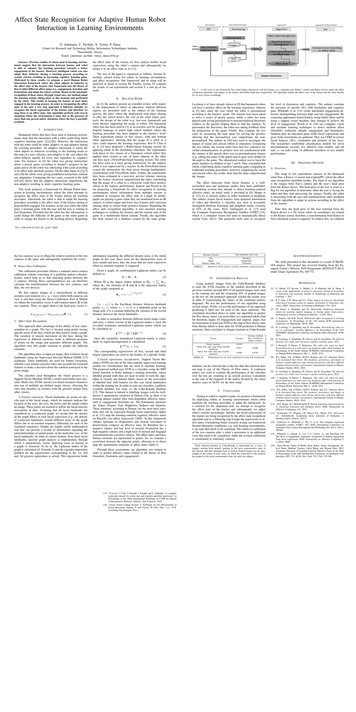

#### Intro

This paper was published in the [FITCE workshop](http://smap2017.org/) in 2017 after my placement at [CERTH](https://www.certh.gr/root.en.aspx).

It is a part of our work in the EU funded (H2020) project [MaTHiSiS](http://www.mathisis-project.eu/).

[Link to pdf version](https://www.iti.gr/iti/files/document/publications/Affect%20State%20Recognition%20for%20Adaptive%20Human%20Robot%20Interaction%20in%20Learning%20Environments.pdf)

#### Paper

